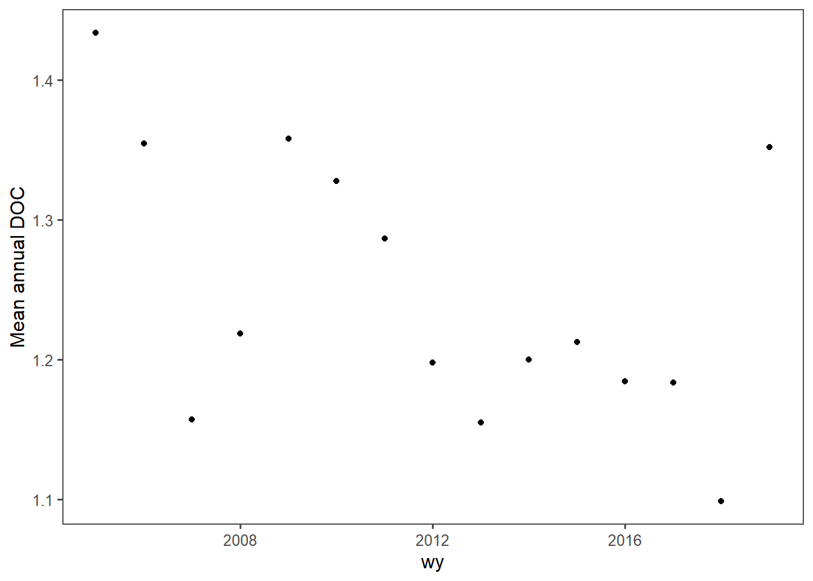

# Set up MS data

First find all data downloaded to MS directory.


```r
macrosheds_root <- here('ms_data')


site_data <- ms_load_sites()
domain_list <- list.dirs(macrosheds_root, recursive = F, full.names = F)
```

Then remove any domains outside of the CONUS.


```r
domain_list <- domain_list[!domain_list %in% c('arctic', 'mcmurdo', 'krycklan', 'luquillo')]
```


Make list of all site files.


```r
site_list <- as.character()
for(i in domain_list){
    loop_sites <- list.files(here('ms_data', i, 'stream_chemistry'),
                                       pattern = '.feather$', full.names = T)
    site_list <- c(site_list,loop_sites)
    }
```

# Intro case at HJ Andrews

Load data for a single site from HJ Andrews to show workflow


```r
site_path <- site_list[50]
solute <- 'DOC'

prep_con_data <- function(site_path, solute){
    target_sol <- paste0('GN_', solute)
    read_feather(site_path) %>%
        filter(var == target_sol) %>%
        select(site_code, datetime, val) %>%
        na.omit()}
con_prep <- prep_con_data(site_path, solute)
```

Summarize to annual mean data and filter out years made from less than 12 observations


```r
nrow(con_prep)
```

```
## [1] 267
```

```r
make_mean_annual <- function(con_prep){con_prep %>%
        mutate(wy = as.integer(as.character(water_year(datetime, origin = 'usgs')))) %>%
        group_by(wy) %>%
        summarize(n = n(),
                  val = mean(val)) %>%
    filter(n > 11)}

con_ann <- make_mean_annual(con_prep)

nrow(con_ann)
```

```
## [1] 15
```
Plot data


```r
plot_annual <- function(con_ann){ggplot(con_ann, aes(x = wy, y = val))+
    geom_point() +
        labs(y = paste0('Mean annual ', solute))+
    theme_few()}

plot_ann <- plot_annual(con_ann)
plot_ann
```



Now detect trends and add to the plot


